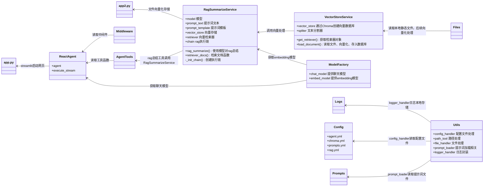

```mermaid
classDiagram
    direction RL
    class app.py {}
    class app2.py {}

    class ReactAgent {
        +agent
        +execute_stream
    }

    class RagSummarizeService {
        +model 模型
        +prompt_text 提示词文本
        +prompt_template 提示词模板
        +vector_store 向量存储
        +retriever 向量检索器
        +chain rag执行链
        +rag_summarize() 使用模型对rag总结
        +retriever_docs() 检索文档函数
        -_init_chain() 创建执行链
    }

    class VectorStoreService {
        +vector_store 通过Chroma创建向量数据库
        +spliter 文本分割器
        +get_retriever() 获取检索器对象
        +load_document() 读取文件、向量化、存入数据库
    }

    class ModelFactory {
        +chat_model 提供聊天模型
        +embed_model 提供embedding模型
    }

    class AgentTools {}

    class Middleware {}

    class Utils {
        +config_handler 配置文件处理
        +path_tool 路径处理
        +file_handler 文件处理
        +prompt_loader 提示词加载相关
        +logger_handler 日志封装
    }

    class Logs {}
    class Config {
        +agent.yml
        +chroma.yml
        +prompts.yml
        +rag.yml
    }
    class Prompts {}
    class Files {}

    ReactAgent --> app.py: streamlit启动网页
    Middleware --> ReactAgent: 读取中间件
    AgentTools --> ReactAgent: 读取工具函数
    ModelFactory --> ReactAgent: 获取聊天模型
    RagSummarizeService --> AgentTools: rag总结工具调用RagSummarizeService
    VectorStoreService --> RagSummarizeService: 调用向量处理
    ModelFactory --> RagSummarizeService: 获取embedding模型
    RagSummarizeService --> app2.py: 文件向量化存储
    Files --> VectorStoreService: 读取本地静态文件，后续向量化处理

    Utils --> Logs: logger_handler日志本地存储
    Utils --> Config: config_handler读取配置文件
    Utils --> Prompts: prompt_loader读取提示词文件
```