# agent_rag_tool_project 架构

## 总体类图

```mermaid
classDiagram
    direction LR

    class app.py {
        +Streamlit页面入口
        +接收用户输入
        +展示Agent流式输出
    }

    class ReactAgent {
        +agent
        +execute_stream()
    }

    class AgentTools {
        +rag_summarize(query) str
        +fill_context_for_report()
    }

    class Middleware {
        +monitor_tool()
        +动态上下文注入
    }

    class RagSummarizeService {
        +query_planner
        +retrieval_service
        +reference_formatter
        +retriever_docs(query) list~Document~
        +rag_summarize(query) str
    }

    class QueryPlanner {
        +query_rewriter
        +build_search_queries(query) list~str~
        +unique_texts(texts) list~str~
    }

    class QueryRewriteService {
        +enabled
        +max_queries
        +rewrite(query) QueryRewriteResult
        -_loads_json(content) dict
        -_clean_text(value) str
        -_clean_list(value) list~str~
        -_unique_texts(texts) list~str~
    }

    class QueryRewriteResult {
        +original_query str
        +rewritten_query str
        +keywords list~str~
        +queries list~str~
    }

    class HybridRetrievalService {
        +vector_store
        +retriever
        +bm25_retriever
        +ranker
        +ensemble_retriever
        +hybrid_retriever(query, final_k) list~Document~
        +multi_query_hybrid_retriever(original_query, queries, final_k) list~Document~
        +get_ensemble_retriever()
        -_merge_hybrid_results(query) dict
        -_merge_bm25_results(query, merged)
        -_merge_vector_results(query, merged)
        -_to_ranked_docs(rank_items) list~Document~
        -_merge_multi_query_results(query, merged)
        -_to_multi_query_docs(rank_items) list~Document~
    }

    class HybridRankItem {
        +doc Document
        +bm25_rank int
        +vector_rank int
        +vector_distance float
        +score float
    }

    class MultiQueryRankItem {
        +doc Document
        +base_score float
        +final_score float
        +query_hit_count int
        +matched_queries list~str~
        +add_match(query, score)
    }

    class RagRanker {
        +tokens(text) set~str~
        +keyword_score(query, doc) float
        +keyword_score_with_tokens(query_tokens, doc) float
        +rank_hybrid_items(merged, query_tokens) list~HybridRankItem~
        +hybrid_score(item, query_tokens) float
        +rank_multi_query_items(merged, original_query_tokens) list~MultiQueryRankItem~
        +multi_query_score(item, original_query_tokens) float
        +doc_key(doc) str
    }

    class RagReferenceFormatter {
        +max_content_chars
        +__init__(max_content_chars)
        +format_references(docs) str
        -_compact_content(content) str
    }

    class VectorStoreService {
        +vector_store
        +spliter
        +md_spliter
        +get_retriever()
        +load_document()
        +load_document_verify()
        +similarity_search_with_score(query, k)
        +retrieval_debug(query)
    }

    class Bm25 {
        +chunk_file_path
        +save_to_jsonl(document)
        +get_chunks() list~Document~
        +get_bm25_retriever()
    }

    class ModelFactory {
        +chat_model
        +embed_model
        +ChatModelFactory.generator()
        +EmbeddingsFactory.generator()
    }

    class Config {
        +agent.yml
        +chroma.yml
        +prompts.yml
        +rag.yml
    }

    class Prompts {
        +main_prompt.txt
        +query_rewrite.txt
        +rag_summarize.txt
        +report_prompt.txt
    }

    class Utils {
        +config_handler.py
        +prompt_loader.py
        +path_tool.py
        +file_handler.py
        +logger_handler.py
    }

    class Eval {
        +rag_recall_eval.py
        +recall_eval.json
        +recall_eval_with_gold.json
    }

    class Data {
        +data/frontend/*.md
    }

    class ChromaStore {
        +chroma_db/chroma.sqlite3
        +chroma_db/chunks.jsonl
        +chroma_db/mapping2.json
        +chroma_db/*.bin
    }

    class Logs {
        +logs/agent_*.log
    }

    app.py --> ReactAgent : 创建并调用
    ReactAgent --> AgentTools : 注册工具
    ReactAgent --> Middleware : 工具调用监控
    ReactAgent --> ModelFactory : 使用chat_model
    ReactAgent --> Prompts : 读取main_prompt

    AgentTools --> RagSummarizeService : rag_summarize工具调用

    RagSummarizeService --> QueryPlanner : 构造检索queries
    RagSummarizeService --> HybridRetrievalService : 检索参考文档
    RagSummarizeService --> RagReferenceFormatter : 格式化参考资料

    QueryPlanner --> QueryRewriteService : rewrite
    QueryRewriteService --> QueryRewriteResult : 返回结构化改写结果
    QueryRewriteService --> ModelFactory : 使用chat_model
    QueryRewriteService --> Prompts : 读取query_rewrite.txt
    QueryPlanner --> Config : 读取rag.query_rewrite配置

    HybridRetrievalService --> VectorStoreService : 向量召回
    HybridRetrievalService --> Bm25 : BM25召回
    HybridRetrievalService --> RagRanker : 排序打分
    HybridRetrievalService --> HybridRankItem : 单query排序单元
    HybridRetrievalService --> MultiQueryRankItem : 多query排序单元

    RagRanker --> HybridRankItem : 计算hybrid_score
    RagRanker --> MultiQueryRankItem : 计算multi_query_score

    VectorStoreService --> ModelFactory : 使用embed_model
    VectorStoreService --> Data : 读取知识库文件
    VectorStoreService --> Utils : 文件加载/路径/日志
    VectorStoreService --> ChromaStore : 写入Chroma向量库
    VectorStoreService --> Bm25 : 保存chunks.jsonl

    Bm25 --> ChromaStore : 读取/写入chunks.jsonl

    Utils --> Config : 读取yaml配置
    Utils --> Prompts : 读取prompt文本
    Utils --> Logs : 写入日志

    Eval --> RagSummarizeService : 调用retriever_docs评估召回
    Eval --> ChromaStore : 对比chunk_id
```

## 核心调用关系

### 在线问答

1. `app.py` 接收用户输入。
2. `ReactAgent` 根据 `main_prompt.txt` 决定是否调用工具。
3. `AgentTools.rag_summarize()` 调用 `RagSummarizeService.rag_summarize()`。
4. `RagSummarizeService` 调用 `QueryPlanner` 构造多路检索 query。
5. `HybridRetrievalService` 执行 BM25 + Chroma 混合检索。
6. `RagRanker` 对单 query 和多 query 结果打分排序。
7. `RagReferenceFormatter` 将检索到的资料压缩为短摘录，并格式化后返回给 Agent。
8. Agent 基于工具返回的参考资料生成最终答案。

### 离线建库

1. `VectorStoreService.load_document()` 读取 `data/frontend/*.md`。
2. `file_handler.py` 加载文件并做 Markdown 标题切分。
3. 切分后的 `Document` 写入 Chroma。
4. 同一批 `Document` 写入 `chroma_db/chunks.jsonl`，供 BM25 使用。
5. `mapping2.json` 记录 chunk 与源文件映射。

### 召回评测

1. `eval/recall/rag_recall_eval.py` 读取 `recall_eval.json`。
2. 调用 `RagSummarizeService.retriever_docs(question)`。
3. 使用真实 RAG 检索链路返回 `Document`。
4. 对比返回的 `chunk_id` 和评测集中的 `gold_chunk_ids`。

## 当前 RAG 模块边界

- `RagSummarizeService`：门面服务，只负责串联 query 规划、检索、参考资料格式化。
- `QueryPlanner`：负责 query rewrite 后的 query 列表构造。
- `QueryRewriteService`：负责调用模型生成 rewritten query、keywords、queries。
- `HybridRetrievalService`：负责 BM25、向量召回、去重和多 query 合并。
- `RagRanker`：负责分词、关键词分、hybrid score、multi query score。
- `RagReferenceFormatter`：位于 `rag/reference_formatter.py`，负责把检索到的 `Document` 压缩为短摘录，并格式化为给 Agent 使用的参考资料文本。

## Prompt 使用情况

- `main_prompt.txt`：Agent 主提示词，约束工具调用和最终回答格式。
- `query_rewrite.txt`：Query rewrite 提示词，由 `QueryRewriteService` 使用。
- `report_prompt.txt`：报告生成场景提示词，由中间件按上下文切换使用。
- `rag_summarize.txt`：历史 RAG 总结提示词，目前主链路不再使用；当前 RAG 工具只返回参考资料，由 Agent 生成最终回答。
